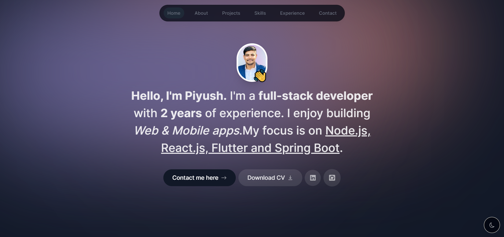

# My Personal Portfolio

Welcome to my personal portfolio website built using Next.js! This portfolio showcases my skills, experiences, and projects. Feel free to explore and get in touch!

## Table of Contents

- [Home](#home)
- [Skills](#skills)
- [Experience](#experience)
- [About Me](#about-me)
- [Contact](#contact)

## Home

Get a glimpse of who I am and what I do. Navigate to the Home section to find an introduction and an overview of my featured projects.

## Skills

In the Skills section, you'll find a breakdown of my technical skills. From front-end technologies like React.js and Flutter to back-end tools like Java and Spring Boot, my skill set is diverse and adaptable.

## Experience

Learn about my professional journey by checking out the Experience section. I've had the opportunity to work on a variety of projects that have enriched my knowledge and expertise.

## About Me

Delve into my background and aspirations in the About Me section. Get to know the person behind the code and discover what drives me to create exceptional software solutions.

## Contact

Connect with me through the Contact Us section. I've integrated an email service to make it easy for you to reach out. Feel free to use the provided form to get in touch!

---

Designed and developed with ❤️ by [Piyush Pagar](https://yourwebsite.com)
